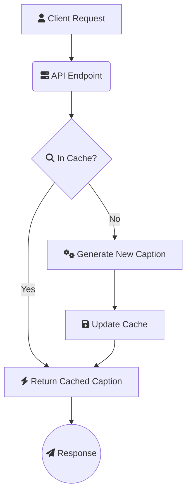

# Image Caption API 🌄📝

[](https://python.org)
[](https://opensource.org/licenses/MIT)
[](https://github.com/psf/black)
[](https://www.docker.com/)

A lightweight FastAPI service that generates descriptive captions for images using state-of-the-art transformer models. Perfect for adding AI-powered image understanding to your applications!

```bash
# Example Request
curl -X POST "http://localhost:8000/caption" \
-H "Content-Type: application/json" \
-d '{"image_urls": ["https://images.unsplash.com/photo-1574144611937-0df059b5ef3e"]}'

# Example Response:
# {
#   "results": [{
#     "url": "https://images.unsplash.com/photo-1574144611937-0df059b5ef3e",
#     "caption": "a cat is sitting on the floor looking at something",
#     "processing_time": 4.128,
#     "success": true,
#     "cached": false
#   }]
# }
```

## ✨ Features

- 🚀 **Blazing Fast**: Asynchronous request handling with `aiohttp` and in-memory caching with `cachetools`.
- 🤖 **State-of-the-Art Models**: Powered by the Hugging Face `transformers` library.
- ⚙️ **Simple Configuration**: Easily configure the application using environment variables (`.env` file).
- 📊 **Monitoring Endpoints**: Includes `/health` checks and `/cache` management endpoints.
- 🐳 **Docker Ready**: Comes with a multi-stage `Dockerfile` for optimized, production-ready images.
- 📦 **Lightweight**: Minimal dependencies and optimized for CPU-based inference.

## 🚀 Quick Start

### Prerequisites
- Python 3.12+
- `pip` and `venv`

### Local Development Setup
1.  **Clone the repository:**
    ```bash
    git clone https://github.com/qwrurodhs/image-caption-api.git
    cd image-caption-api
    ```

2.  **Create and activate a virtual environment:**
    ```bash
    # For Linux/macOS
    python3 -m venv venv
    source venv/bin/activate

    # For Windows
    python -m venv venv
    .\venv\Scripts\activate
    ```

3.  **Install dependencies from `requirements.txt`:**
    ```bash
    pip install -r requirements.txt
    ```

### Configuration
Create a `.env` file in the root directory to override default settings.

**`.env` example:**
```ini
# Application Settings
PORT=8000
LOG_LEVEL=INFO
HTTP_TIMEOUT=10

# Model & Cache Settings
MODEL_NAME=nlpconnect/vit-gpt2-image-captioning
DEVICE=cpu  # Use 'cuda' for GPU acceleration
CACHE_MAXSIZE=512
```

### Running the Service
Launch the application using Uvicorn. It will automatically detect and load the `.env` file.
```bash
uvicorn app:app --host 0.0.0.0 --reload
```
Once running, the interactive API documentation will be available at `http://127.0.0.1:8000/docs`.

## 🐳 Docker Deployment

The included `Dockerfile` creates an optimized, secure production image.

1.  **Build the Docker image:**
    ```bash
    docker build -t image-caption-api .
    ```

2.  **Run the Docker container:**
    ```bash
    # Run with a .env file for configuration
    docker run -p 8000:8000 --env-file .env --name caption-api image-caption-api

    # Run without a .env file (uses defaults set in the Dockerfile)
    docker run -p 8000:8000 --name caption-api image-caption-api
    ```

## 📡 API Endpoints

### Generate Captions
`POST /caption`

Generates captions for a list of provided image URLs.

**Request Body:**
```json
{
  "image_urls": [
    "https://example.com/image1.jpg",
    "https://example.com/image2.png"
  ]
}
```

**Successful Response (200 OK):**
```json
{
  "results": [
    {
      "url": "https://example.com/image1.jpg",
      "caption": "a beautiful landscape with mountains and a lake",
      "processing_time": 3.456,
      "success": true,
      "cached": false
    },
    {
      "url": "https://example.com/image2.png",
      "caption": "Failed to fetch image.",
      "processing_time": 0.512,
      "success": false,
      "cached": false
    }
  ]
}
```

### Health Check
`GET /health`

Checks the operational status of the service, including model and cache status.

**Successful Response (200 OK):**
```json
{
  "status": "healthy",
  "model_loaded": true,
  "cache_size": 42,
  "timestamp": 1678886400.123
}
```

### Cache Management

`GET /cache/info`

Retrieves statistics about the in-memory cache.

**Successful Response (200 OK):**
```json
{
  "current_size": 42,
  "max_size": 512,
  "hits": 150,
  "misses": 50,
  "hit_rate": "75.00%"
}
```

`DELETE /cache/clear`

Clears all items from the cache and resets its statistics.

**Successful Response (200 OK):**
```json
{
  "message": "Cache cleared successfully",
  "previous_size": 42
}
```

## 🏗️ Architecture



## ⚡ Performance Tips

1.  **GPU Acceleration**: For a 5-10x performance boost, run on a machine with an NVIDIA GPU, install the CUDA-enabled PyTorch, and set `DEVICE=cuda` in your environment.
2.  **Batch Requests**: The API is designed to handle multiple URLs in a single `/caption` request. Batching requests reduces network overhead.
3.  **Optimize Cache**: Adjust `CACHE_MAXSIZE` based on your available memory and the diversity of your image requests.
4.  **Fast Image Hosting**: Ensure images are served from a fast, low-latency source like a CDN to minimize download time.

## 🤝 Contributing

Contributions are welcome! Please follow the standard fork-and-pull-request workflow.

1.  Fork the repository.
2.  Create a new feature branch (`git checkout -b feature/your-awesome-feature`).
3.  Make your changes and commit them (`git commit -m 'Add some awesome feature'`).
4.  Push to the branch (`git push origin feature/your-awesome-feature`).
5.  Open a Pull Request.

## 📄 License

This project is licensed under the MIT License - see the [LICENSE](https://mit-license.org/license.txt) file for details.

## 🙏 Acknowledgements

-   Powered by [Hugging Face Transformers](https://huggingface.co/)
-   Uses the [nlpconnect/vit-gpt2-image-captioning](https://huggingface.co/nlpconnect/vit-gpt2-image-captioning) model
-   Built with [FastAPI](https://fastapi.tiangolo.com/) and [PyTorch](https://pytorch.org/)